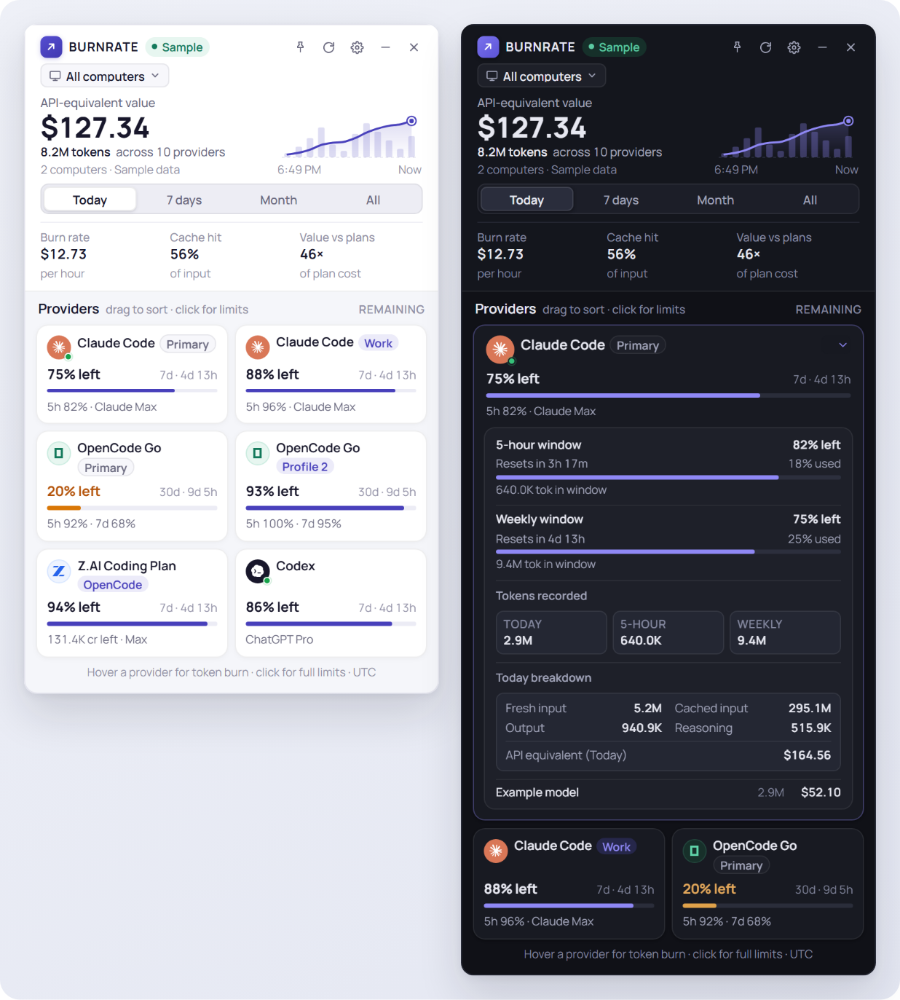

# myBurnRate

**The local-first cost meter for AI coding agents.** See what Claude Code, Codex, OpenCode, Grok
Build, Antigravity and the rest are worth at published API rates, which plan window runs out first,
and what each repository costs — in one compact desktop window.

myBurnRate reads the usage your tools already record on your computer, prices it against
effective-dated official rate cards, and shows what is left of every plan window or prepaid balance.
It listens on `127.0.0.1` only. There is no vendor account, no proxy, no analytics, and no prompts,
code or responses are ever stored.

[](https://github.com/kamol-nazarov/myBurnRate/actions/workflows/ci.yml)
[](https://github.com/kamol-nazarov/myBurnRate/releases/latest)
[](LICENSE)
[](pyproject.toml)
[](#install)

> **Current release:** `v0.5.5` · [Release notes](docs/releases/RELEASE-0.5.5.md) · [Changelog](CHANGELOG.md)

<p align="center">
  
</p>

<p align="center"><sub>Screenshots use synthetic sample data from <code>burnrate desktop --demo</code>.</sub></p>

## Why myBurnRate

- **One window for every tool.** Claude Code, Codex, OpenCode, ZCode, Grok Build, Antigravity, Muse
  Code and your pay-as-you-go balances sit side by side, each read independently.
- **Value, not just tokens.** Recorded tokens are priced at published API rates for the exact day
  they were used, so you can see what a month of agent work would have cost on the API.
- **Plan headroom at a glance.** Every 5-hour, weekly and monthly window shows what is left and when
  it resets; the optional dashboard adds a run-dry forecast from your recent pace.
- **Answers you can defend.** Missing data stays missing: exact, derived, partial and unavailable
  are separate states, and a gap never renders as `$0.00`.
- **Yours alone.** Local SQLite, operating-system keychain, loopback-only listener, no telemetry.

## Install

### Windows 10 or 11 — native desktop app (recommended)

Run this in PowerShell. It installs for your user account, so there is no administrator prompt:

```powershell
irm https://raw.githubusercontent.com/kamol-nazarov/myBurnRate/prod/scripts/install-native.ps1 | iex
```

The script reads `native-latest.json` from the latest GitHub Release, checks the release URL, the
installer's byte size and its SHA-256 digest, then runs the per-user installer silently. myBurnRate
lands in `%LOCALAPPDATA%\Programs\BURNRATE` with Start Menu and Desktop shortcuts, and opens on its
first-run screen. Your data lives separately in `%LOCALAPPDATA%\BURNRATE`.

You can also download **`myBurnRate_<version>_x64-setup.exe`** directly from the
**[latest release](https://github.com/kamol-nazarov/myBurnRate/releases/latest)**. Installed copies
check for updates about a minute after launch and then daily; **Settings → General → Check for
updates** does it on demand, and **Install & restart** applies a verified update.

### Every platform

| System | Download | What it is |
| --- | --- | --- |
| Windows 10 or 11 (64-bit) | `myBurnRate_<version>_x64-setup.exe` | **Native desktop window.** Light, Dark and System themes, tray mode, verified in-app updates. Installs per user. |
| Windows 10 or 11 (64-bit) | `BURNRATE_<version>_x64-setup.exe` | Sidecar HUD and full web dashboard. This is also what Scoop installs. |
| macOS 11 or later (Apple Silicon) | `BURNRATE_<version>_aarch64.dmg` | Sidecar HUD and full web dashboard. |
| Linux (x86-64) | `BURNRATE_<version>_amd64.AppImage` or `.deb` | Sidecar HUD and full web dashboard. |
| Python 3.12 (any OS) | `burnrate-<version>-py3-none-any.whl` | Command line, background service (`burnrate serve`) and `burnrate desktop`. |

With [Scoop](https://scoop.sh) on Windows:

```powershell
scoop install https://github.com/kamol-nazarov/myBurnRate/releases/latest/download/myburnrate.json
```

A winget package (`KamolNazarov.myBurnRate`) follows once the installer is Authenticode-signed.

**First launch**

- **Windows:** the installers are not yet Authenticode-signed while the SignPath Foundation
  application is pending, so SmartScreen may show "Windows protected your PC". Choose **More info**
  and then **Run anyway**. Verify the download first if you prefer (see below).
- **macOS:** the app is not notarized. Open **System Settings → Privacy & Security** and choose
  **Open Anyway** next to BURNRATE, or run `xattr -dr com.apple.quarantine /Applications/BURNRATE.app`
  once.
- **Linux:** make the AppImage executable with `chmod +x BURNRATE_*.AppImage`, or install the `.deb`.

**Verify a download**

Every file is built on GitHub Actions from a tagged commit and recorded in `SHA256SUMS`. Replace
`<version>` with the version from the release page:

```bash
gh attestation verify myBurnRate_<version>_x64-setup.exe --repo kamol-nazarov/myBurnRate
sha256sum -c SHA256SUMS
```

## What it does

### The native desktop window

The main interface is a compact, frameless Windows app built on Edge WebView2, with an automatic
Tk/ttk fallback when WebView2 is unavailable. It bundles its **Manrope** variable font, so it makes
no font or asset requests to a CDN.

- **Split hero.** Today's API-equivalent value sits beside an interactive interval timeline. Hover or
  focus the timeline and use the arrow keys to read the running total and each interval's
  contribution.
- **Summary strip.** Burn rate (average value per hour today, per day otherwise), cache hit share of
  prompt tokens, and value vs. plans for the selected span.
- **Two-column provider tiles.** Each tile shows recorded tokens and reference value, then expands
  full-width for window meters, reset countdowns and a two-column token ledger: fresh input, cached
  input, cache writes, output, reasoning and API-equivalent value. Reorder tiles by dragging them in
  two dimensions, or focus one and press `Alt+↑` / `Alt+↓`. The grid stacks to one column on narrow
  windows.
- **Periods and scope.** `Today`, `7 days`, `Month` and `All`, filtered to **All computers** or a
  single machine.
- **Multiple accounts.** Separate Claude Code profiles and OpenCode accounts appear as their own
  tagged tiles instead of being merged.
- **Themes and window behavior.** Light, Dark and System themes, always-on-top pinning, optional
  transparency when the pointer leaves the window, a saved window position, and a notification-area
  icon. Closing the window keeps collection running; reopen it from the tray or the Start Menu.
- **Accessible by default.** Keyboard navigation with visible focus rings, reduced-motion support,
  WCAG AA contrast in both themes, and a 10.5 px minimum text size.

### Plans, balances and alerts

- **Every plan window** a source can report — 5-hour, weekly, monthly — with remaining share and a
  reset countdown.
- **Prepaid balances** for OpenRouter and DeepSeek, shown as money remaining rather than a fake quota.
- **Desktop notifications** when a plan passes its alert level (90% by default), when it will run out
  before it resets, when a meter has gone stale for over an hour, or when hub sync keeps failing.
  Quiet hours (22:00–07:00 by default) hold them back unless a run-out is under two hours away. Each
  kind can be switched off, and `BURNRATE_DESKTOP_NOTIFICATIONS=0` turns them all off.

### The optional dashboard

Served at `/` when you set `BURNRATE_ENABLE_DASHBOARD=1`; otherwise `/` opens the HUD. It adds
run-dry forecasting per plan window, a **Plans & Value** comparison of subscription spend against
API-equivalent value, an **Action Center** for thresholds and source issues with snooze and
acknowledge workflows, and token economics by tool, model, project and session. The always-on-top
sidecar HUD at `/hud` keeps the same information in a narrow floating window, including cost per
repository and a weekly share card.

## Supported tools

| Tool | Usage and value | Plan or balance meter |
| --- | --- | --- |
| Claude Code | yes | 5-hour and weekly, from the plan usage Claude Code and Claude Desktop cache |
| Codex | yes | weekly |
| OpenCode with a Z.AI Coding Plan, and ZCode | yes | 5-hour and weekly |
| OpenCode Go | yes | 5-hour, weekly and monthly |
| Grok Build | yes | weekly |
| Google Antigravity | yes | Gemini and other-model windows |
| Muse Code | yes | 5-hour and weekly |
| Traycer | yes, per CLI (experimental) | — |
| OpenRouter (through Traycer) | yes | account balance, with a management key |
| DeepSeek | — | account balance, with an API key |
| OpenAI and Anthropic organizations | optional, with an admin key | — |

Some of these readers depend on undocumented files or endpoints and are marked **experimental**.
Each one fails on its own without affecting the others, and an experimental outage is reported as
unavailable rather than as zero usage. A second Claude Code account or OpenCode profile gets its own
tile, its own meter and its own tag. Hosts, files and network calls for every source are documented
in [providers](docs/providers.md).

## How the numbers work

myBurnRate prices recorded tokens with effective-dated rate cards built only from official provider
price pages. Usage before a card's first effective date stays unpriced rather than back-filled.

| Label | Meaning | How the app shows it |
| --- | --- | --- |
| **Exact** | An invoice-authoritative usage source *and* an `exactness: exact` rate card. | plain amount |
| **Derived** | Published-rate attribution of included-plan usage. Not a bill. | `≈` when complete, partial when only a priced subset is known |
| **Unavailable** | No trustworthy sample: missing file, skipped key, incomplete telemetry, unpriced model. | a dash, never `$0` |
| **Partial** | Some events in the window are priced and some are not. | named as partial, with the unpriced models listed |

Subscription fees you configure are prorated separately and never mixed into API-equivalent value.
The full rules, including cache counterfactuals and duplicate suppression, are in
[plans and value](docs/plans-value.md) and [pricing](docs/pricing.md).

## Privacy and security

- **Loopback only.** The service binds `127.0.0.1:17331` by default. Nothing is exposed to your
  network unless you deliberately put a reverse proxy or Tailscale Serve in front of it.
- **Read-only readers.** Harness SQLite files are opened with `mode=ro` and `PRAGMA query_only=ON`.
  JSONL and log files are opened for reading. myBurnRate never writes another tool's files and never
  reads or reuses Claude's sign-in.
- **Numbers, not content.** The database stores times, model keys, token counts, project folder
  names and plan readings. It never stores prompts, responses, reasoning text, diffs, code or tool
  payloads.
- **Keys stay out of the database.** Optional provider keys are tested when you add them, then stored
  in Windows Credential Manager, the macOS Keychain or the Secret Service. They are never logged,
  never returned by the API, and never written to SQLite.
- **Few, named network calls.** An installed copy checks GitHub Releases for updates. The Z.AI and
  OpenCode Go meters are on by default with a switch in setup; they contact only their own provider,
  using the key that tool already stores. Everything else runs only with a key you add, and only a
  hub you run receives your usage.
- **Verified updates.** A native update must match the release URL, byte size, SHA-256 and an Ed25519
  minisign signature pinned inside the app, and (when the app is signed) the publisher's Authenticode
  identity, before it runs. `BURNRATE_NO_UPDATE_CHECK=1` disables every update check.

The complete file, column and host inventory is in [privacy](docs/privacy.md). To report a
vulnerability, use [SECURITY.md](SECURITY.md); never open a public issue with secrets.

## More than one computer

myBurnRate can self-host its own hub, so a laptop and a desktop share one history without a cloud
account.

1. **Run a hub.** On an always-on machine, open the setup wizard at
   `http://127.0.0.1:17331/setup`, choose **Make this the hub**, and create a pairing code. A Docker
   deployment with automatic HTTPS is in the [self-hosting guide](docs/self-hosting.md).
2. **Join from every other computer.** Open **Settings → Computers** and paste the pairing code under
   **Join with code**, or sign in to your hub account with the hub address, account and computer
   name.
3. **Select the scope.** Choose **All computers**, or one machine, from the scope control in the
   desktop window.

The hub is also available as a container image, `ghcr.io/kamol-nazarov/myburnrate-hub`, built for
x86-64 and ARM. The [self-hosting guide](docs/self-hosting.md) covers Docker with automatic HTTPS,
Tailscale, backups and `burnrate hub update`. A spoke keeps its last synced history when the hub is
unreachable and labels a local-only fallback instead of showing another machine as zero.

## Command line

The wheel installs one command, `burnrate`:

```text
burnrate desktop [--demo] [--port PORT]     native usage window
burnrate serve [--host H] [--port P]        local service and optional dashboard
burnrate demo [--no-browser]                sample data in a temporary folder
burnrate init                               create the database
burnrate doctor                             check Python, data, pricing, assets, loopback bind
burnrate sync --hub URL --token br_m_...    push this computer's usage to a hub
burnrate machines list|register|revoke      manage paired computers on a hub
burnrate subscription add|list|apply        effective-dated plans
burnrate backfill                           advanced historical import
burnrate pricing-refresh | pricing-audit    review rate cards and expiring prices
burnrate hub update --ssh HOST              update a self-hosted hub over SSH
```

Try the interface without collecting anything:

```powershell
burnrate demo                 # HUD with a month of synthetic usage
burnrate desktop --demo       # native window with synthetic usage
```

Configuration is environment-driven. [Configuration](docs/configuration.md) lists every variable,
including `BURNRATE_ENABLE_DASHBOARD`, `SPEND_DATABASE_PATH`, `SPEND_TIMEZONE` and
`BURNRATE_NO_UPDATE_CHECK`.

## Upgrade and uninstall

- **Native app:** use **Settings → General → Check for updates**, or let it check on its own. Updates
  never touch `%LOCALAPPDATA%\BURNRATE`.
- **HUD edition:** click the update bar in the HUD or choose **Check for updates** from the tray.
- **Python installs:** `python -m pip install --upgrade burnrate`.
- **Self-hosted hub:** `burnrate hub update`, or pull a newer container tag.
- **Uninstall:** remove **myBurnRate** from Windows' installed apps. The uninstaller removes the
  program and shortcuts and offers, unticked and only interactively, to delete your data too. To
  wipe manually, stop the service and delete `%LOCALAPPDATA%\BURNRATE`.

## Build from source

Requires CPython 3.12. WebView2 ships with Windows 11 and current Windows 10 installs; without it the
native window falls back to Tk, which needs Tcl/Tk.

```powershell
git clone https://github.com/kamol-nazarov/myBurnRate.git
cd myBurnRate
python -m pip install -e ".[dev]"
burnrate desktop --demo
python -m pytest
```

Build the portable native bundle, and the NSIS installer when `makensis` is on `PATH`:

```powershell
python -m pip install pyinstaller
python packaging/build_native.py                    # portable zip; installer only if makensis exists
python packaging/build_native.py --require-installer  # fail instead of skipping the installer
```

The [development guide](docs/development.md) covers the Windows service scripts, the demo dataset,
screenshot regeneration and the front-end build. [Native app](docs/native-app.md) covers the
installer, update feed and signing. Contributions are welcome; start with
[CONTRIBUTING.md](CONTRIBUTING.md).

## Documentation

| Document | What it covers |
| --- | --- |
| [User guide](docs/user-guide.md) | Setup, notifications, several computers, the dashboard, and what the numbers mean |
| [Native desktop app](docs/native-app.md) | Everyday use, the per-user installer, verified updates, and building it |
| [Providers](docs/providers.md) | Every source, its files, hosts, stability label and double-count rules |
| [Pricing](docs/pricing.md) · [Plans & value](docs/plans-value.md) | Rate cards, exact vs. derived, proration and value multiples |
| [Privacy](docs/privacy.md) · [Security policy](SECURITY.md) | What is stored, what is sent, and how to report a vulnerability |
| [Configuration](docs/configuration.md) | Environment variables, plans and on-demand backfill |
| [Troubleshooting](docs/troubleshooting.md) | Empty states, missing meters, stuck sources and diagnostics |
| [Self-hosting](docs/self-hosting.md) · [Tailscale](docs/tailscale.md) | Running your own hub with HTTPS |
| [Architecture](docs/architecture.md) | Runtime, HTTP surface, persistence and the provider boundary |
| [Development](docs/development.md) · [Releasing](docs/releasing.md) | Working on the code and shipping a release |
| [Code signing](docs/code-signing.md) · [Changelog](CHANGELOG.md) | Supply chain policy and every release |

## Project status and support

myBurnRate is actively developed and free to use. The current stable line is `0.5.x`; undocumented
provider readers are labeled experimental and can change without a major version bump. Supported
platforms for the packaged apps are Windows 10/11 (x64), macOS 11+ on Apple Silicon, and Linux
x86-64; the Python package runs on any OS with CPython 3.12.

- **Questions and reproducible bugs:** open an [issue](https://github.com/kamol-nazarov/myBurnRate/issues)
  using the template. Redact paths, hostnames and keys.
- **Security:** follow [SECURITY.md](SECURITY.md) and use a private advisory.
- **Conduct:** see [CODE_OF_CONDUCT.md](CODE_OF_CONDUCT.md).

## Code signing and supply chain

Free code signing is provided by [SignPath.io](https://about.signpath.io/), with a certificate from
the [SignPath Foundation](https://signpath.org/). The application is pending approval; until then,
Windows installers are unsigned and SmartScreen will warn on first launch.

Only Windows installers built by this repository's release workflow are signed, and every signing
request is approved by hand. Committers, reviewers and approvers:
[kamol-nazarov](https://github.com/kamol-nazarov). The full policy, including what the app sends over
the network, is in [docs/code-signing.md](docs/code-signing.md).

Releases are built only on GitHub Actions from a tagged commit, carry a `SHA256SUMS` file, and are
attested with build provenance. In-app updates are verified against an Ed25519 key pinned in the app.
Dependency audits, a secret scan and a hermetic test suite run on every push.

## License

[Apache License 2.0](LICENSE). Use, modify and redistribute it freely, including in commercial and
closed-source products, provided you retain the license and [NOTICE](NOTICE) files and state
significant changes. The license includes an express patent grant and comes with no warranty.

Third-party notices, bundled fonts and provider trademarks are listed in [NOTICE](NOTICE).

myBurnRate is not affiliated with, endorsed by or sponsored by OpenAI, Anthropic, Cursor, xAI,
Google, Z.AI, OpenRouter, DeepSeek, Requesty, Traycer, Muse or their products. Product and provider
names identify compatible local files, documented APIs and plans you configured yourself. All
trademarks belong to their owners.
